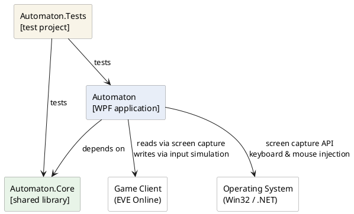
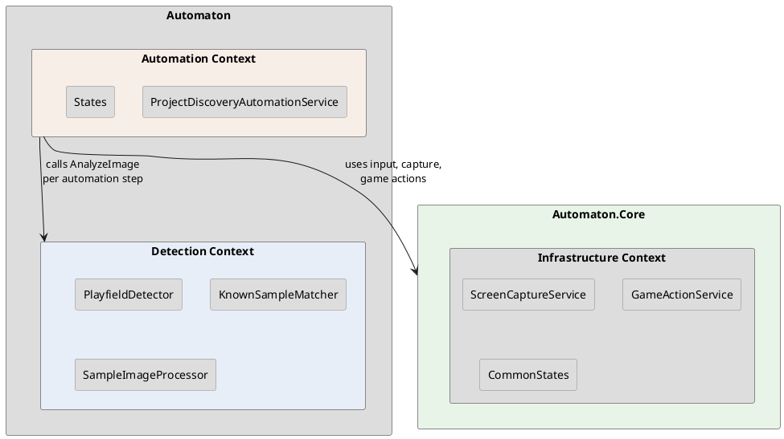
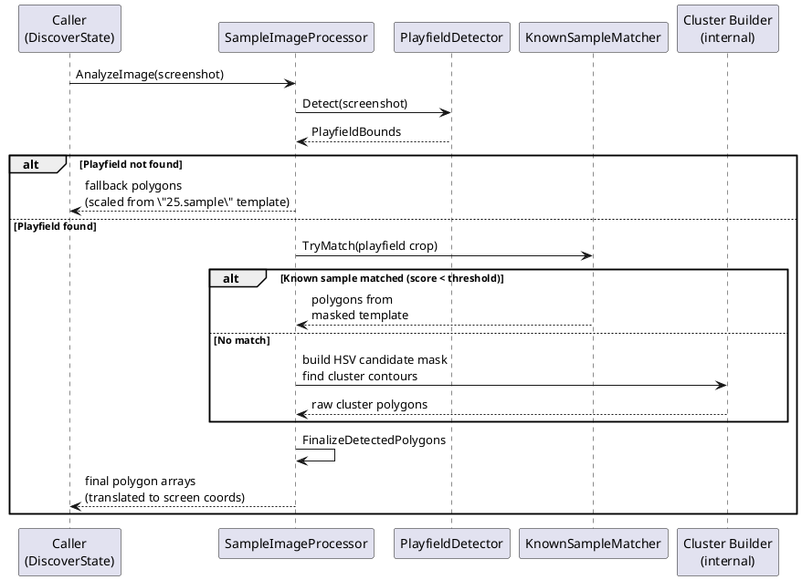
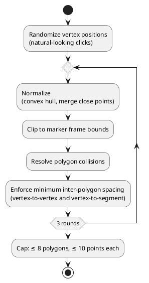
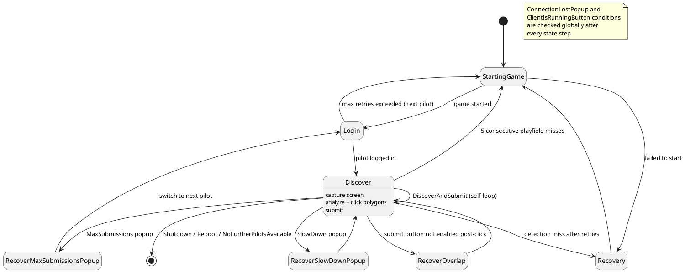
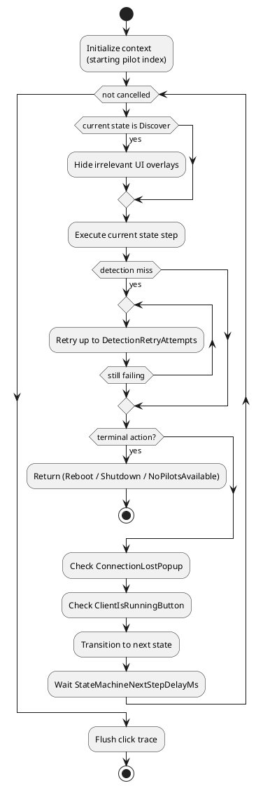

# Technical Design Description - Automaton <!-- omit from toc -->

---
**Author:** `Viacheslav Shyshkin [Developer]`
**Guideline Version:** `1.1`

**Modification History:**
- **V1.0:** by shyshkiv `30-Jul-2026`: **Initial version**

## Table of Contents <!-- omit from toc -->

- [Purpose](#purpose)
- [Scope](#scope)
- [References](#references)
- [Abbreviations and Definitions](#abbreviations-and-definitions)
- [Unit Safety Classification](#unit-safety-classification)
- [Unit Design Notes / Decisions](#unit-design-notes--decisions)
- [Overview](#overview)
  - [Considerations for a Secure Design](#considerations-for-a-secure-design)
  - [Considerations for Localization](#considerations-for-localization)
  - [Context Map](#context-map)
- [Detection Context](#detection-context)
  - [Image Analysis Pipeline](#image-analysis-pipeline)
  - [Playfield Detection](#playfield-detection)
  - [Cluster Detection](#cluster-detection)
  - [Known-Sample Matching](#known-sample-matching)
  - [Polygon Finalization](#polygon-finalization)
- [Automation Context](#automation-context)
  - [State Machine](#state-machine)
  - [Orchestration](#orchestration)
  - [Rate Limiting](#rate-limiting)
- [Infrastructure Context (Automaton.Core)](#infrastructure-context-automatoncore)

---

## Purpose

This document outlines the design of the **Automaton** tool — a WPF desktop application that automates participation in the *Project Discovery* citizen-science mini-game embedded in the MMO game *EVE Online*. The mini-game presents scatter plots of biological cell data and asks participants to draw polygon annotations around visible cell clusters. Automaton captures the game screen, detects the cluster regions using computer vision, constructs polygon annotations, and submits them through automated UI interaction.

The intended audiences for this document include developers adding new automation targets or detection capabilities, and reviewers assessing the overall design approach.

While this document provides a high-level design overview, for detailed implementation information please consult the source code directly.

## Scope

This TDD covers all three projects in the Automaton solution:

- **Automaton.Core** — project-agnostic shared library (screen capture, input control, common states, telemetry)
- **Automaton** — the domain-specific WPF application (image analysis pipeline, automation state machine, UI)
- **Automaton.Tests** — automated test suite

It describes the architectural decisions, the context boundaries, and the key workflows of each context.

## References

| Reference | Title                    |
| :-------- | :----------------------- |
| 1         | Discovery_Strategy.md — polygon identification best practices and known design decisions (repository root) |

## Abbreviations and Definitions

| Abbreviation | Description                         |
|:-------------|:------------------------------------|
| TDD          | Technical Design Description        |
| WPF          | Windows Presentation Foundation     |
| HSV          | Hue–Saturation–Value (color model)  |
| OCR          | Optical Character Recognition       |
| DI           | Dependency Injection                |

## Unit Safety Classification

Not applicable — Automaton is a non-regulated, non-IVD personal automation tool with no safety classification requirement.

## Unit Design Notes / Decisions

| Design Decision | Justification | Architectural Constraint |
|:----------------|:--------------|:-------------------------|
| **Core / App split** | Reusable infrastructure (screen capture, input, telemetry) is kept project-agnostic in `Automaton.Core` to allow reuse across future automation targets. | `Automaton.Core` must not import game- or discovery-specific logic. Domain constants, settings, and configuration belong in `Automaton`. |
| **State machine for automation flow** | The game interaction is a sequential, multi-step process with distinct failure modes, each requiring different recovery. A state machine makes every step and transition explicit and individually testable. | Each state is responsible for exactly one phase; cross-cutting concerns (connection lost, client not in foreground) are checked at the orchestration level, not inside states. |
| **HSV color as primary detection signal** | Cell clusters are visually vivid and saturated; the surrounding game UI is dark or low-saturation. Color provides a reliable, stable separation. Grayscale-first detection was evaluated and caused over-splitting and incorrect merges on the gold-standard sample set. | Grayscale is still used where it is the right tool: playfield marker detection (high-contrast template matching) and known-sample signature comparison. |
| **Known-sample matching shortcut** | Certain scatter-plot patterns recur across sessions. Re-detecting an already-known pattern from noisy dots is less accurate than using the pre-annotated gold-standard mask directly. | Matching is performed only against the playfield crop (not the full screenshot) to avoid sensitivity to window position, DPI scaling, and surrounding UI. |
| **Polygon finalization as a multi-round pipeline** | Any step that mutates polygon points can reintroduce constraint violations (out-of-bounds, overlaps, insufficient spacing). Running a single final pass is not sufficient. | The finalization pipeline runs three rounds of: normalize → clip to marker bounds → resolve collisions → enforce spacing. Point randomization (for natural-looking clicks) must happen before this pipeline so randomized points are subject to all constraints. |
| **Transient states, singleton detectors** | States are stateless and created fresh per step; detectors are computationally expensive to initialize (loading templates, building Mat objects) and must be shared. | All `*Detector` and `*Processor` types are registered as singletons; all `*State` types are registered as transient. |

## Overview

Automaton automates the full lifecycle of a Project Discovery submission session:

1. Launch and connect to the running game client.
2. Log in with a configured pilot account.
3. For each game round: capture the screen, analyze the scatter plot, click polygon points, and submit.
4. Recover from server popups, rate-limit throttling, detection failures, and network interruptions.
5. Cycle through multiple pilot accounts when one exhausts its daily submission quota.
6. Escalate from recovery → game restart → OS reboot when repeated failures indicate an unrecoverable state.

The application also supports a batch **sample-processing mode** (`--process-samples` argument) where it processes a folder of screenshot samples offline, saving annotated output images for pipeline tuning and verification.

### Considerations for a Secure Design

No specific security considerations apply. The tool operates locally, interacts only with a game client through OS-level screen capture and input simulation, and exposes no network surface.

### Considerations for Localization

Logs are always in English; no localization is needed.

### Context Map

Within the `Automaton` project, responsibility is divided across three contexts:

## Detection Context

The Detection Context is responsible for transforming a raw screenshot into a list of polygon annotations ready for submission. It is stateless and operates purely on images.

### Image Analysis Pipeline

### Playfield Detection

`PlayfieldDetector` locates the rectangular playfield area by finding the four corner marker images within the screenshot. It uses multi-pass grayscale template matching, progressively relaxing the match threshold when fewer than four candidates are found. Grayscale is the appropriate signal here: corner markers have strong, distinctive shapes and high local contrast that make them reliably identifiable regardless of color.

The output is a plain `Rect` (not a polygon). Playfield detection is not a cluster-finding step — it is purely boundary discovery.

### Cluster Detection

When no known-sample match is found, the full detection pipeline runs:

1. **Candidate mask** — an HSV color mask isolates vivid, saturated pixels (the plotted cells) from the dark/desaturated game UI.
2. **Cluster extraction** — the candidate mask is blurred, dilated, and thresholded to form cluster blobs; contours are extracted and filtered by minimum area.
3. **Splitting** — large contours that likely represent multiple distinct populations are split using one of several strategies, tried in priority order: connected-component decomposition, horizontal/vertical density valley, density-seed Voronoi, or k-means point clustering.
4. **Merge-back** — sibling polygons from a split may be re-merged if they meet conservative area-ratio and proximity criteria. Merging must be conservative: two nearby same-size polygons are usually genuinely distinct clusters, not split artifacts.
5. **Sparse-cluster recovery** — if exactly one polygon was found and there is a clearly detached lower population of candidate points below the primary cluster, a narrow recovery pass adds a second polygon. This fallback is intentionally local and density-aware; it is not a second general-purpose detector.

### Known-Sample Matching

`KnownSampleMatcher` tries to match the current playfield crop against a library of pre-annotated samples stored in the `templates` folder. The match is based on a compact image signature (96×96 grayscale crop with Gaussian blur). If the best candidate's mean-absolute-difference score falls below a configured threshold, the corresponding `*.template.masked.png` mask is used to extract polygons directly.

This is an intentional shortcut, not a hack. Certain scatter-plot layouts recur reliably across sessions. Re-detecting a known pattern from noisy dots is consistently less accurate than reading back the gold-standard annotation.

Template signatures are cached for the process lifetime since the templates folder is stable during a run.

### Polygon Finalization

After polygons are built, `FinalizeDetectedPolygons` enforces game constraints and natural-looking click patterns through a fixed pipeline:

Key invariants:
- Randomization happens **before** the pipeline, so randomized points are still subject to all constraints.
- Each round re-normalizes and re-clips because any mutation step (collision resolution, spacing enforcement) can re-introduce bound violations or overlaps.
- Spacing enforcement checks **vertex-to-segment** distance, not only vertex-to-vertex, to catch cases where a vertex is close to a polygon edge even when no two vertices are directly close.
- Upper-band polygons (whose centroid lies in the marker-band region) have an additional ceiling at the top marker row to prevent bleeding into UI territory.

## Automation Context

The Automation Context drives the game client through its full session lifecycle. It is implemented as a state machine where each state performs one discrete step and returns a transition to the next state.

### State Machine

`ConnectionLostPopup` and `ClientIsRunningButton` are cross-cutting interrupts: they can occur after any state step and are handled by the orchestrator, not by individual states.

### Orchestration

`ProjectDiscoveryAutomationService` owns the main loop:

A hard escalation ladder guards against stuck loops: if `StartingGame` transitions exceed `MaximumStartingGameTransitionsBeforeReboot`, the tool triggers an OS reboot rather than continuing to spin.

The automation context (`ProjectDiscoveryAutomationContext`) is a small mutable record carrying per-session state: current pilot index, consecutive playfield miss counter, and the last action kind. It is passed to each state's `Execute` call.

### Rate Limiting

The Discover state enforces a maximum submission rate (5 per 70-second rolling window) before each Submit click. This prevents triggering the game server's throttle, which would result in a SlowDown popup and a forced wait.

## Infrastructure Context (Automaton.Core)

`Automaton.Core` is a project-agnostic library. It must not import any domain-specific or game-specific logic — that boundary is enforced structurally by the project reference direction.

It provides:

| Component | Responsibility |
|:----------|:--------------|
| `ScreenCaptureProvider` / `ScreenCaptureService` | Capture the current screen; save annotated debug images to the telemetry captures folder |
| `AutomationInputController` | Inject keyboard and mouse events via Win32; enforce per-action minimum delays |
| `GameActionService` | High-level game interactions (start game, quit game, toggle windows, reboot OS) built on top of the input controller |
| `ClickTraceRecorder` | Record all click coordinates for post-session telemetry |
| `CommonLoginState` / `CommonStartGameState` / `CommonRecoverClientIsRunningButtonVisibleState` | Reusable state implementations that contain no project-specific logic |
| `Config` / `Delays` / `VirtualKeys` | Shared primitive constants |
| `TelemetryRootDirectory` / `AvatarsDirectory` | Stable path resolution for runtime folders (captures, logs, templates, avatars) |
| `UserSettings` / `PrivateSettings` | Persistent user preferences and non-committed credential storage |